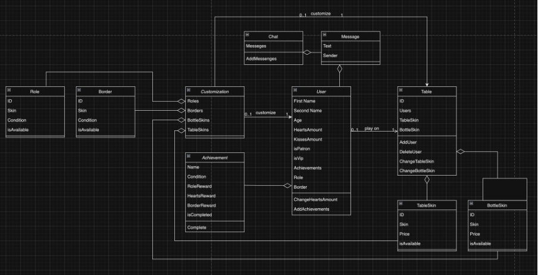

<h1 align="center">Spin The Bottle - Find Your Love</h1> 
<h2 align="center">“Мобильное приложение для знакомств”</h2>

<h4>Пользователи, сидящие за одним столом, по кругу крутят бутылочку, в итоге она указывает на случайного человека противоположного пола. Появляется 2 варианта развития событий: “Поцеловать” или “Отказаться”.
В первом случае пользователи “Целуются”, что приводит к увеличению счётчика поцелуев в профиле каждого из них. С небольшим шансом в результате этого каждый из пользователей может получить виртуальную валюту – сердечко.
Во втором случае пользователи возвращаются на свои места за столом и ход передаётся следующему участнику.</h4>

<h4>Далее:</h4> 
“Сердца” – виртуальная валюта, используемая для  транзакций.
    
“Поцелуи” – количество успешных поцелуев после вращения бутылочки.

<h3>Особенности:</h3>

1. Виртуальная валюта «Сердечки», за которые можно приобретать те или иные полезности, о которых будет рассказано дальше.  Валюту можно получить выполняя действие “Поцеловаться”, с помощью просмотра рекламных роликов и путём покупки за реальные деньги.

2. Подарки, которые можно отправлять любому участнику игры в любой момент времени за виртуальную валюту.
   
3. Бутылочка, скин которой можно менять  за виртуальную валюту.
   
4. Стол, скин которого можно менять за виртуальную валюту.
 
5. Профиль пользователя, в котором отображаются достижения, общее количество поцелуев, ещё какая-то информацию о нём.

6. Система достижений, которые будет получать пользователь за различные действия, совершённые в игре. В награду за достижения можно будет получить “роль” – тег, описывающий суть достижения, который пользователь сможет отображать в своём профиле.
   
7. Реферальная программа, в результате которой пользователь, который привёл в игру друга, получит вознаграждение в виде виртуальной волюты.
   
8. Ежедневный бонус, который пользователь будет получать при входе игру, а так же дополнительные бонусы, которые пользователь сможет получить, выполнив определённые игровые действия каждый день.
   
9. Таймер АФК – изгнание из-за столика в случае неактивности пользователя в течении N минут.
    
10. Чат, где пользователи смогут свободно общаться.
    
11. ЛС после после одобрения запроса обоими пользователями.

<h3>Сущности:</h3>

<h4>Класс “User” - пользователь:</h4>

    1.	First Name – имя пользователя
    2.	Second Name – фамилия пользователя
    3.	Age  – возраст пользователя
    4.	HeartsAmount – количество сердец у пользователя
    5.	KissesAmount – количество поцелуев у пользователя
    6.	TableSkins – доступные скины для стола
    7.	BottleSkins – доступные скины для бутылочки
    8.	isPatron – совершал ли пользователь покупки (используется для отслеживания платёжеспособной аудитории)
    9.	isVip – куплена ли Vip подписка
    10.	 Achievements – список достижений пользователя
    11.	 Role – список ролей пользователя
    12.	 ChangeHeartsAmount – метод для изменения количества сердец
    13.	 AddAchievenets – метод для добавления новых достижений

<h4>Клacc “Message” - сообщение:</h4>

    1.	Text – содержание сообщения
    2.	Sender – отправитель сообщение

<h4>Класс “Chat” – чат:</h4>

    1.	Messages – список отображаемых сообщений
    2.	AddMessages – метод для добавления нового сообщения в чат

<h4>Класс “Table” – столик:</h4>

    1.	ID – уникальный идентификатор
    2.	Users – список пользователей за столом
    3.	TabelSkin – установленный скин стола
    4.	BottleSkin – установленный скин бутылочки
    5.	AddUser – метод для добавления пользователя за столик
    6.	DeleteUser – метод для удаления пользователя из-за столика
    7.	ChangeTableSkin – метод для изменения скина столика
    8.	ChangeBottleSkin – метод для изменения скина бутылочки

<h4>Класс “TableSkin” – скин столика:</h4>

    1.	ID – уникальный идентификатор
    2.	Skin – скин
    3.	Price – стоимость установки скина
    4.	isAvailable – доступность установки пользователем

<h4>Класс “Role” – роль:</h4>

    1.	ID – уникальный идентификатор
    2.	Skin – скин
    3.	Condition – условие получение
    4.	isAvailable – доступность установки пользователем

<h4>Класс “Border” – скин обводки аватарки:</h4>

    1.	ID – уникальный идентификатор
    2.	Skin – скин
    3.	Condition – условие получение
    4.	isAvailable – доступность установки пользователем

<h4>Класс “BottleSkin” – скин бутылочки:</h4>

    1.	ID – уникальный идентификатор
    2.	Skin – скин
    3.	Price – стоимость установки скина
    4.	isAvailable – доступность установки пользователем

<h4>Класс “Achievement” – достижение:</h4>

    1.	Name – название
    2.	Condition – условие получения
    3.	RoleReward – роль в качестве награды
    4.	HeartsReward – сердца в качестве награды
    5.	BorderReward – обводка аватарки в качестве награды
    6.	isCompleted – выполнение достижения

<h4>Класс “Customization” – кастомизация пользователя:</h4>

    1.	Roles – список ролей
    2.	Borders – список обводок аватарки
    3.	BottleSkins – скины бутылочки
    4.	TableSkins – скины столика

 

<h3 align="center">Class Diagram</h3> 

    

